1. **机器级程序将内存视为一个非常大的字节数组，称为虚拟内存(virtual memory)。内存中每个字节都由一个唯一的数字来标识，称为该字节的地址(address)，所有可能地址的集合就称为虚拟地址空间(virtual address space)。虚拟地址空间只是一个展现给机器级程序的概念性映像**。

2. C语言中一个指针的值（无论它指向一个整数、一个结构或是某个其它程序对象）都是某个存储块的第一个字节的虚拟地址。C编译器把每个指针和类型信息联系起来，这样可以根据指针值的类型，生成不同的机器级代码来访问存储在指针所指向位置处的值。C编译器生成的实际机器级程序并不包含关于数据类型的信息，这些信息只协助编译器生成机器指令。**每个程序对象可以简单地视为一个字节块，而程序本身就是一个字节序列**。

3. 十进制 -> k进制：
	整数部分：除k取余法，从下往上取；
	小数部分：乘k取整法，从上往下取。
	
4. k进制 -> 十进制：
	$$
	\sum_ia_iw_i，其中a_i为第i位上的数，w_i为该位上的权。
	$$

5. 二进制 -> 8/16进制：从右往左，3/4位一组转换。

6. k进制就是逢k进1，认识到这点，对k进制的运算可以不必转换为十进制再做运算，如`0x50ea-0x503c=0x50ae`。

7. 无符号数的编码：
   $$
   \sum_{i}2^ia_i，其中a_i为第i位上的值（0/1）。
   $$
   

   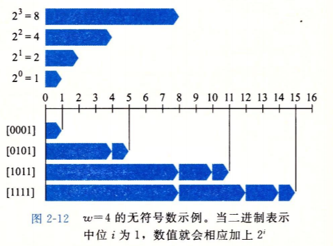

8. 有符号数的编码：

   1. 原码(sign-magitude)，最高有效位是符号位，用于确定剩下的位应该取负权还是正权。由此原码有两个零。
      $$
      对向量\vec{x}=[x_{w-1}, x_{w-2}, ..., x_0]，有B2S_w = (-1)^{x_{w-1}}\sum_{i=0}^{w-2}x_i2^i
      $$
      
   2. 补码(two's-complement)，最高位固定为负权，其余为正权：
      $$
      对向量\vec{x}=[x_{w-1}, x_{w-2}, ..., x_0]，有B2T_w = -x_{w-1}2^{w-1} + \sum_{i=0}^{w-2}x_i2^i
      $$
      `|Tmin| = |Tmax| + 1`，注意到补码中，负数的除最有有效位(most significant bit)外的位为1，会使该负数变大，因为只有MSB为1时，该数就是Tmin，全1得到-1。
      
      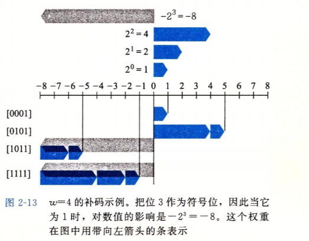
      
   3. 正数的原码、反码、补码都一样。

   4. 将负数转换为补码，首先不管符号，数值部分转换为二进制/原码（到这里跟正数转换为补码的步骤一样，区别在于正数转换为补码只需要做到这一步，再设置符号位就完成了），然后对数值部分取反加一，再设置MSB符号位为1。其中取反加一还可以进一步等价地简记为数值部分从低位开始，至第一个1不变，其余取反。

9. 无符号数与补码间的转换：

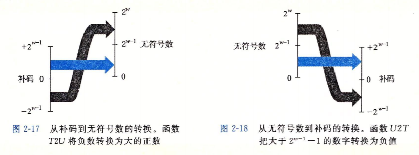

10. 对无符号数进行零扩展，对补码进行符号扩展，前者的正确性（扩展后的数值不变）是显然的，后者的正确性证明如下：

    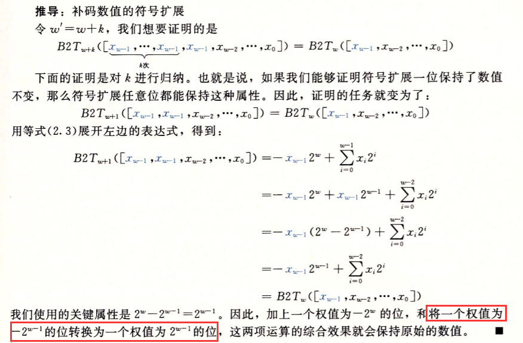

11. $$
    无符号数截断为k位，可进行mod \space 2^k运算，也就是直接取低k位，对补码截断，则要将截断后的最高数值位转换为符号位，即该位的权由2^{k-1}转换为\pm2^{k-1}。
    $$

13. 补码加法，若符号不同，不会溢出，若符号相同，结果与操作数符号不同，则溢出。

14. 乘以2的幂相当于左移，除以2的幂相当于右移。

15. IEEE754浮点数标准：

    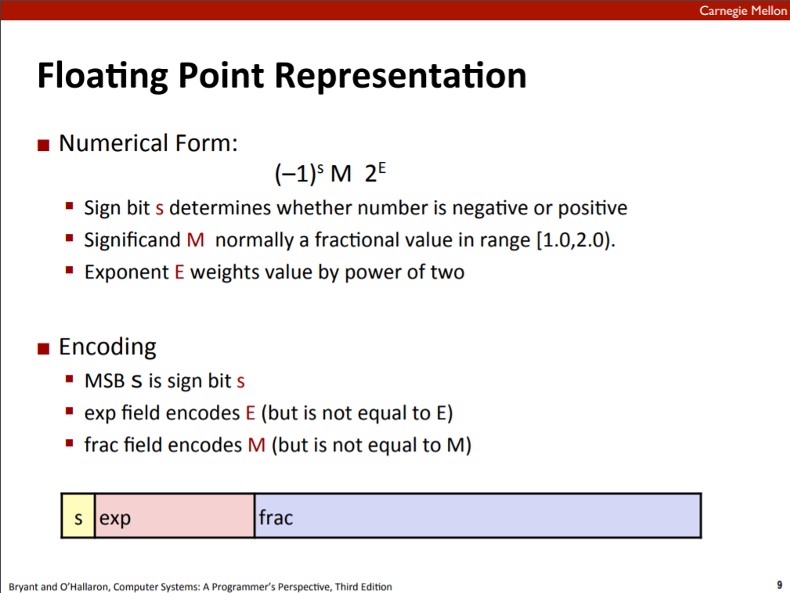

    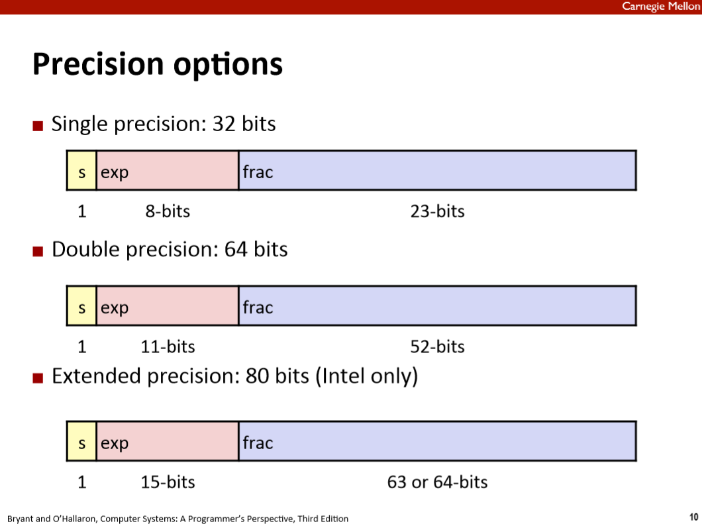

    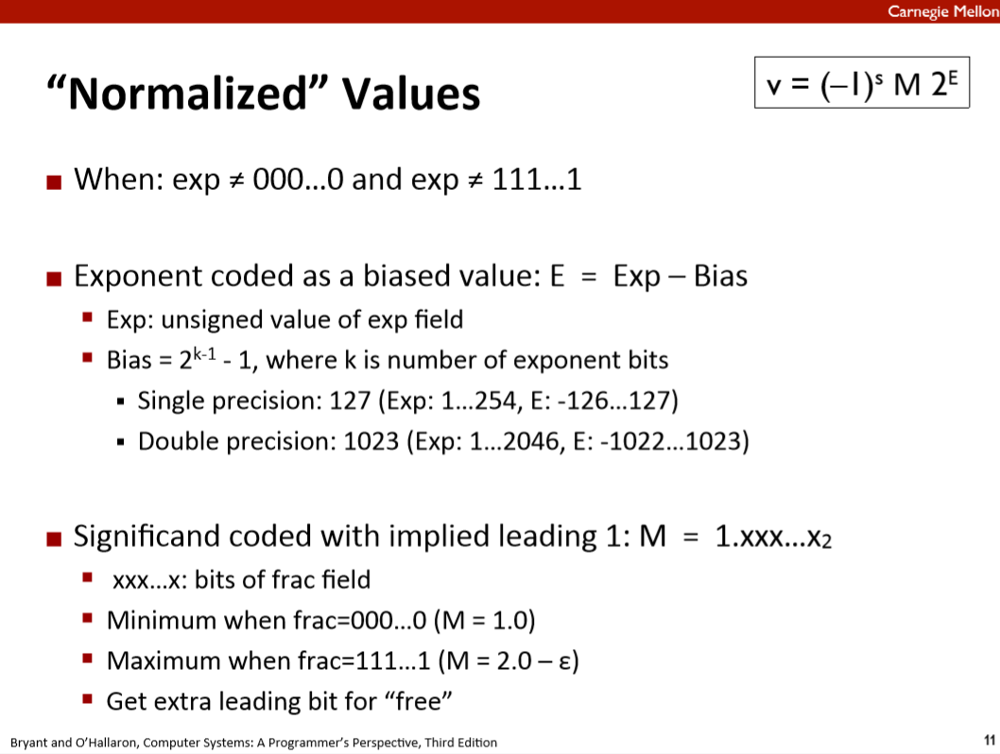

    注意到，exp全0和全1被用于非规格化数和特殊值，所以exp的范围变为1~254。至于为什么32位浮点数规格化的bias选择127而不是128，似乎原则上都可以。

    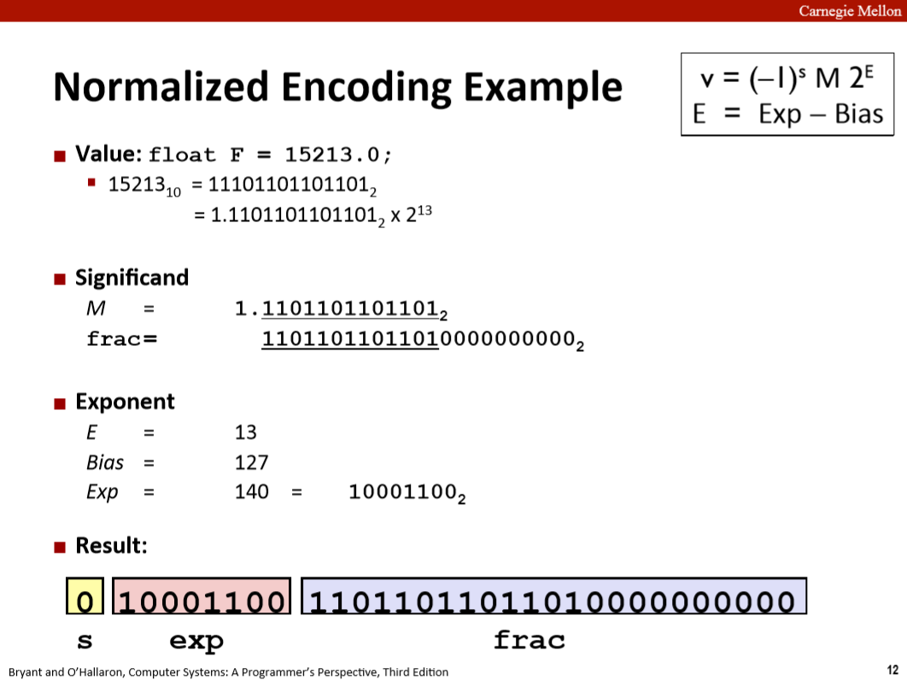

    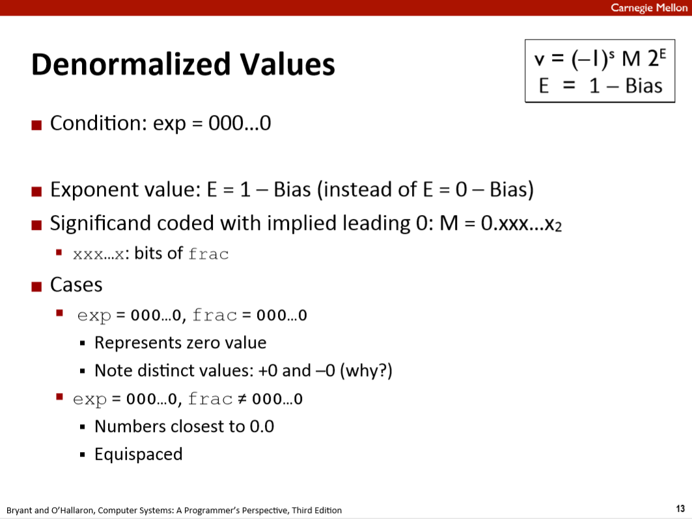

    当exp为0时，即为非规格化数。注意，虽然exp为0，但却选择`E=1-Bias`而不是`E=0-Bias`。这是因为这样定义E使得非规格化值能够**平滑地**转换到规格化值。在前者的定义中，我们给E加了1，即`E=Exp-Bias+1`，这补偿了非规格化数的尾数没有隐含的开头的1。（其实还是不太明白怎么回事，但下图/实践就说明了这样定义E确实有这样的效果/作用）

    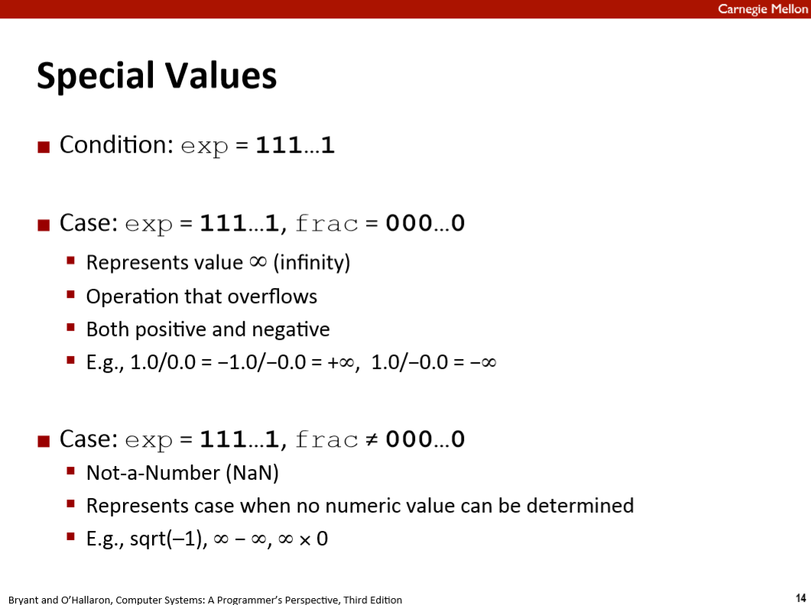

    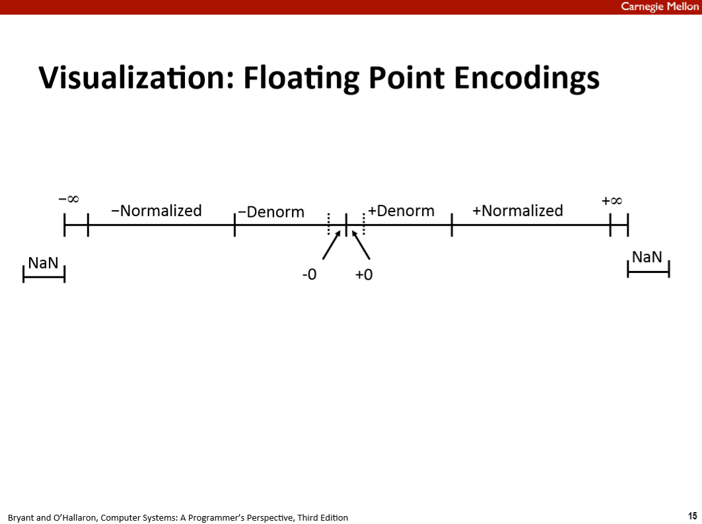

    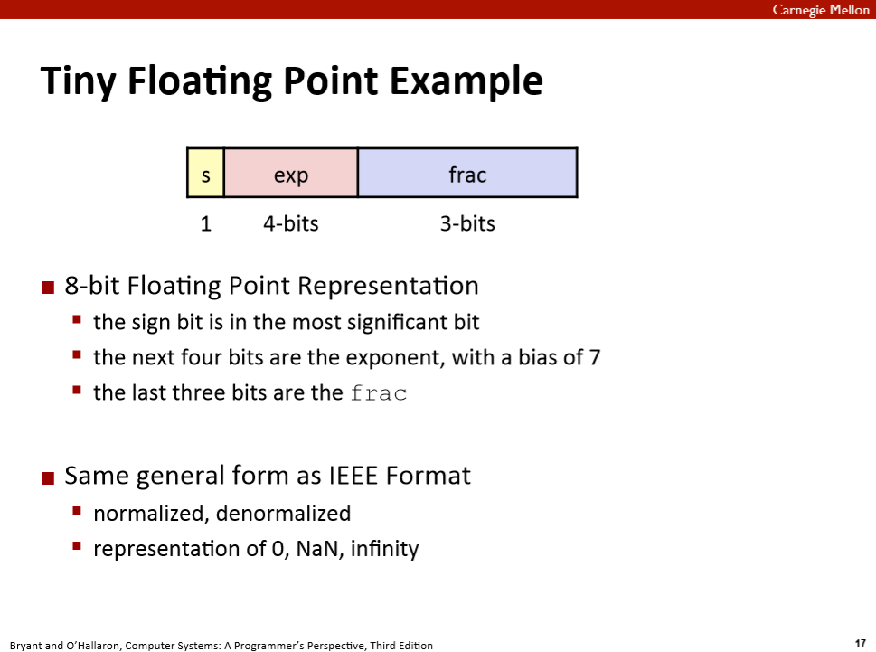

    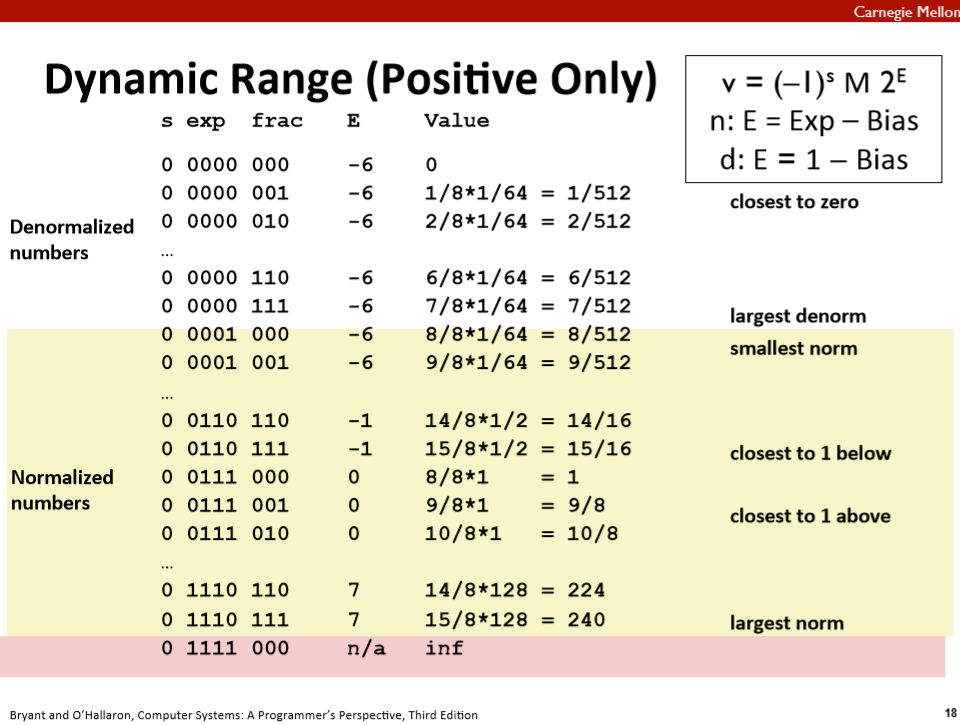

    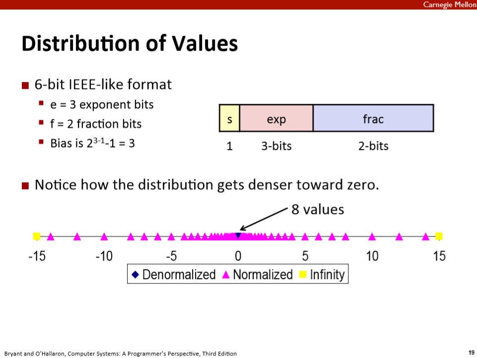

    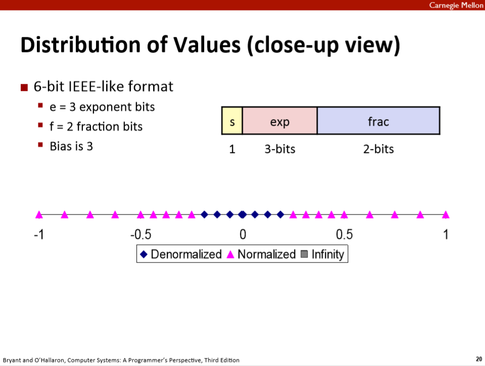

    注意到非规格化数的分布是均匀的，即任意两数之间的间隔一定，因为E相同、保持不变，而规格化数的分布则不均匀，因为E不同、会变化。

