1. 开始前要先看一下一下几份材料：

   1. http://csapp.cs.cmu.edu/2e/docs/gdbnotes-x86-64.pdf
   2. http://www.cs.cmu.edu/afs/cs/academic/class/15213-f15/www/recitations/rec04.pdf

2. 先看bomb.c中的main函数，了解一下执行流程，然后gdb打开bomb程序，`b phase_1`，`r`，`disas`：

   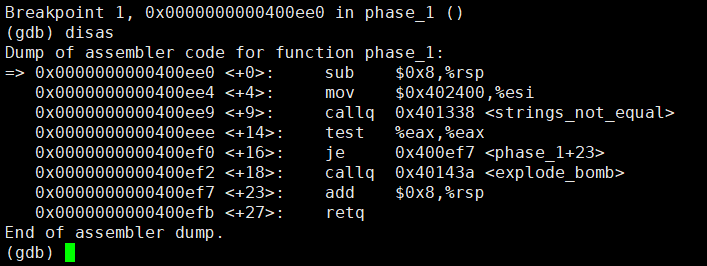

   从调用的函数名可看出，是比较我们的输入与某个字符串是否相等。第一个参数%edi被设置为指向我们输入的字符串的地址，而第二个参数%esi自然也就是指向程序期望的那个字符串的地址，所以看一下该地址处的内容即可：`x/s 0x402400`。

3. `delete`，`b phase_2`，`r answer`，`disas`：

   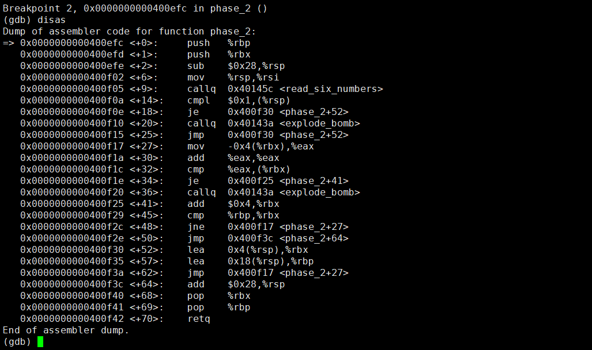

   首先`sub $0x28,%rsp`为该函数的栈帧（C语言中，每个栈帧对应着一个未运行完的函数。栈帧中保存了该函数的返回地址和局部变量。）中多分配了40字节的栈空间，然后从我们输入的字符串中读入六个数字，从`mov %rsp,%rsi`可看出函数read_six_number会将读出的六个数字存放在phase_2的栈帧中。`b read_six_number`，`c`，`disas`：

   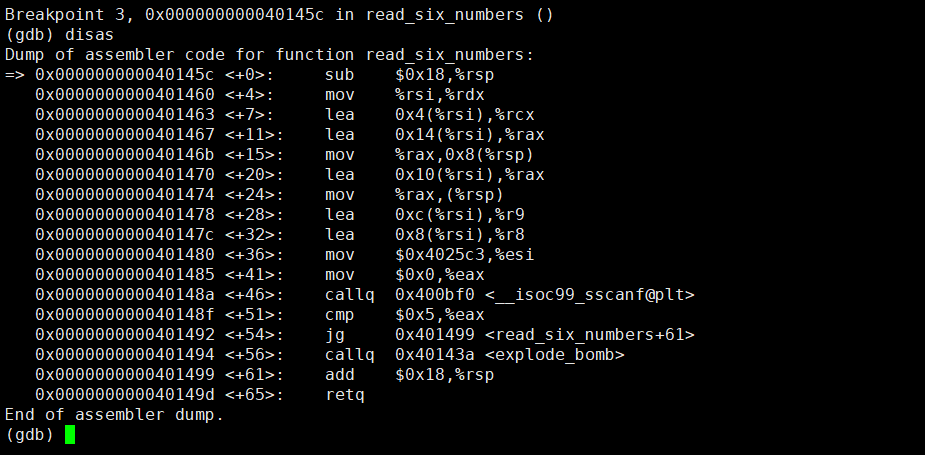

   看到函数read_six_number调用了C库函数：`int sscanf(const char *str, const char *format, ...);`。我们从callq调用语句往上看参数设置，看到`mov $0x4025c3,%esi`，所以format就在地址0x4025c3处，`x/s 0x4025c3`，显示`"%d %d %d %d %d %d"`。**注意，多于6个参数，其余参数按序存放在caller的栈帧中**。从其余参数的设置可知道，read_six_number返回后phase_2的栈帧如下：

   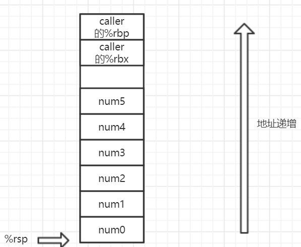

   看来作者没有在存放位置上坑我们，只是简单地顺序存放。

   实际上我们只需输入6个数，执行完read_six_number后，用`x/6w $rsp`看一下就知道这些数被read_six_number放到了哪些位置，不需要看read_six_number的代码。**也就是只需看read_six_number的行为，不需要关注它如何实现**。

   回到phase_2，从中间的循环可以看出：`num0=1`，`numi=2*num(i-1)`。

4. 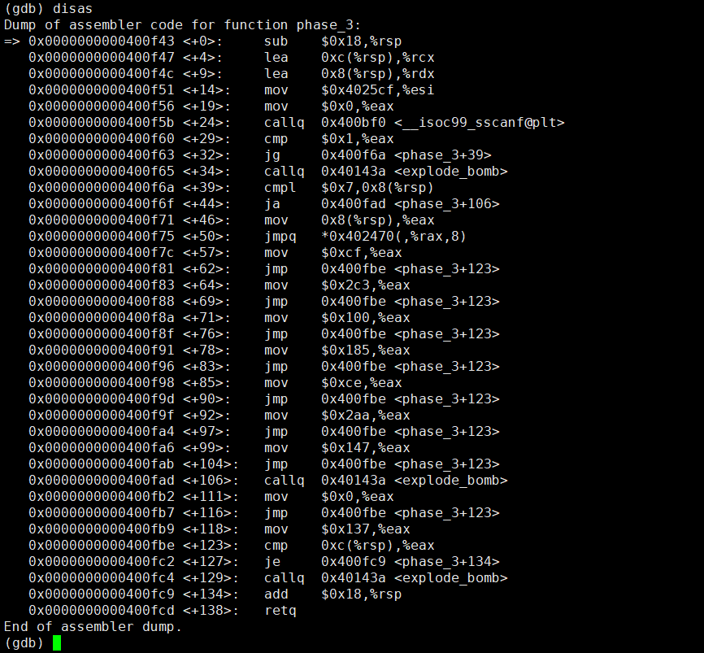

   看一下format字符串，`x/s 0x4025cf`，输出`"%d %d"`。sscanf分别将num0和num1存放在0x8(%rsp)和0xc(%rsp)中。往下看可知道`num0<=0x7`。然后`jmpq   *0x402470(,%rax,8)`，看一下0x402470处的内容，`x 0x402470`，输出0x00400f7c，也就是根据num0的值来跳转。这里有多个分支，每个分支要求num1被为某个值。选择其中一个分支来设置num0和num1即可。

5. 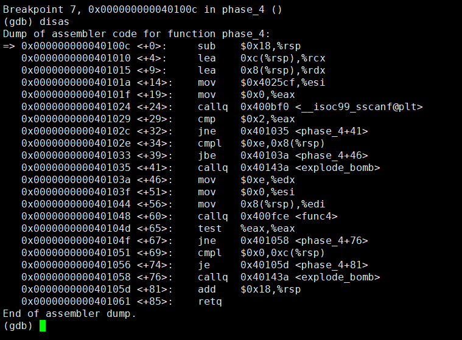

   读入两个数，要求`num0<=0xe`，接着调用了func4，三个参数分别为(num0, 0, 0xe)，这里可以不用管这个调用，继续看后面要求`num1==0`，所以这样就可以了。

6. 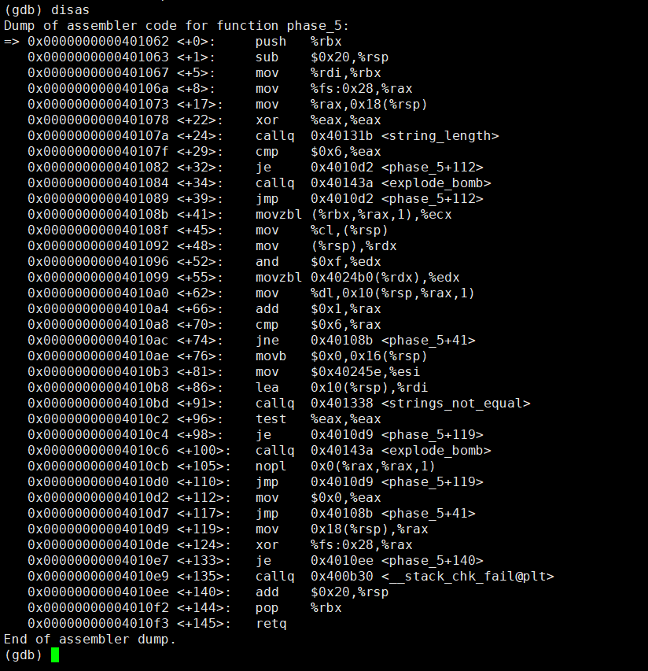

   要求输入字符串长度为6，从+41行开始是一个循环，该循环从地址0x4024b0处，用输入字符串每个字符做偏移，赋值一个字节/字符到地址%rsp+0x10处。之后调用strings_not_equal比较%rsp+0x10处的字符串与地址0x4024e5处的字符串，

   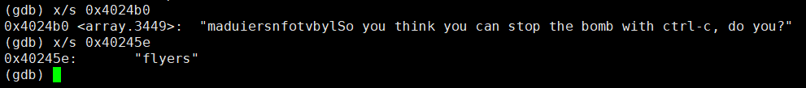
   
   所以只需要构造好输入字符串的每个字符，作为偏移量，从0x4024b0处的字符串中选出合适的字符即可。
   
   注意到`and $0xf,%edx`，也就是只拿一个字符的低4位来作为偏置，所以高4位可以任意填充，这使得我们可以将控制字符替换掉。
   
   ```python
   src = "maduiersnfotvbylSo you think you can stop the bomb with ctrl-c, do you?"
   target = "flyers"
   for c in target:
       print(src.find(c))
   ```
   
   然后`man ascii`查表。
   
7. 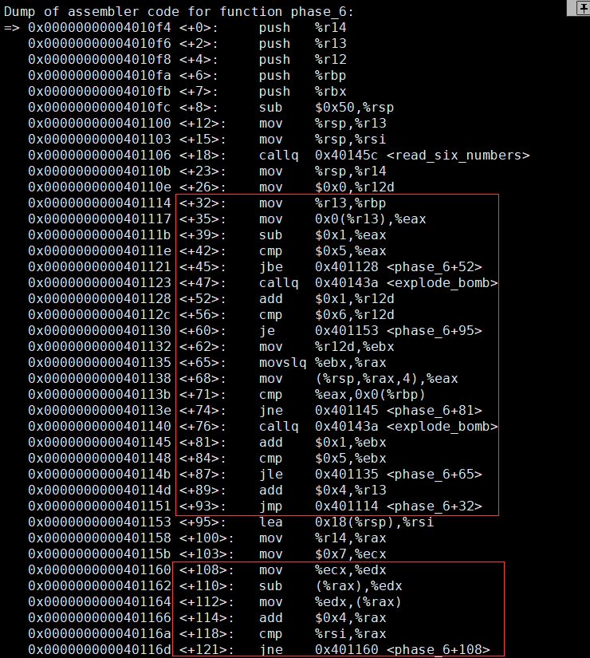

   仍然调用read_six_sum读入6个数，接下来是一个外循环嵌套内循环，外循环要求`numi-1<=5`，内循环要求这些数字两两不相等。接下来一个循环，将当前栈帧中的6个数替换为`7-numi`。

   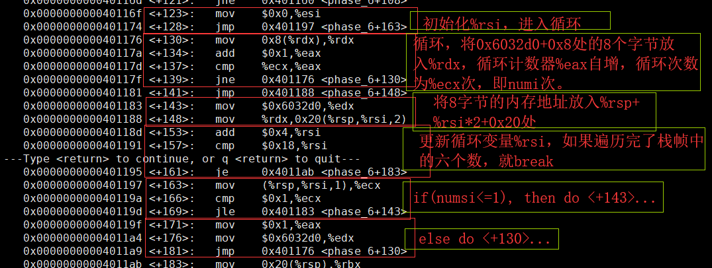

   上面的注释有一点错，是循环numi-1次。

   看一下内存地址0x6032d0处的数据：
   
   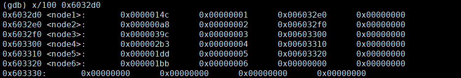
   
   可以看出是一些结构体对象，大小为16字节，即0x10字节。结构体的定义类似于：
   
```c
   struct node {
       int val; // 4字节
       int id;  // 4字节
       struct node* next; // 8字节
   }
```

   假设%rdx存放一个node对象的地址，那么(%rdx)访问该node对象的4字节val成员，0x8(%rdx)访问该node对象的8字节next成员。


   所以，这个循环也就是根据numi选中0x6032d0的第numi个node对象（1-based），然后将其8字节地址放入%rsp+0x20相应位置。为了方便后面叙述，这里假设该循环执行完后，%rsp+0x20到%rsp+0x50的内容为：&node0, &node1, &node2, &node3, &node4, &node5，&是取地址运算，node0中的0表示这是由num0作为偏移选中的node对象。

   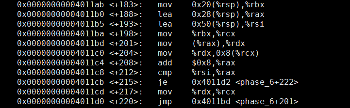

   这个循环依次遍历%rsp+0x20处的地址，在该循环中，%rcx指向前驱结点，%rdx指向当前结点，该循环使得`node(i-1)指向nodei`。注意`lea 0x28(%rsp),%rax`并不是内存访问，而只是计算内存地址。

   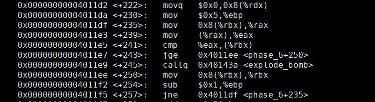

   在上一个循环结束后，%rdx为栈帧中&node5的地址，%rbx则仍为%rsp+0x20，该循环中%rbx指向当前结点，%rax指向后继结点，然后要求`%rbx->val >= %rax->val`。

   到这里，观察0x6032d0处的node对象的val值，可构造出`3 4 5 6 1 2`，而前面还将输入的numi替换为7-numi，所以正确的输入序列是`4 3 2 1 6 5`。