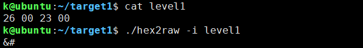
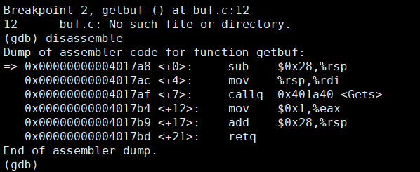
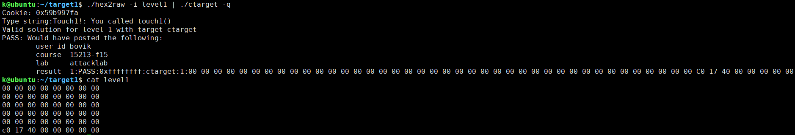
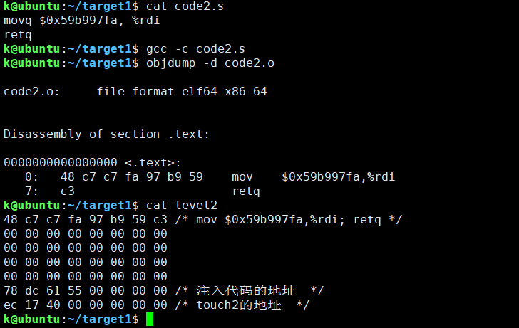
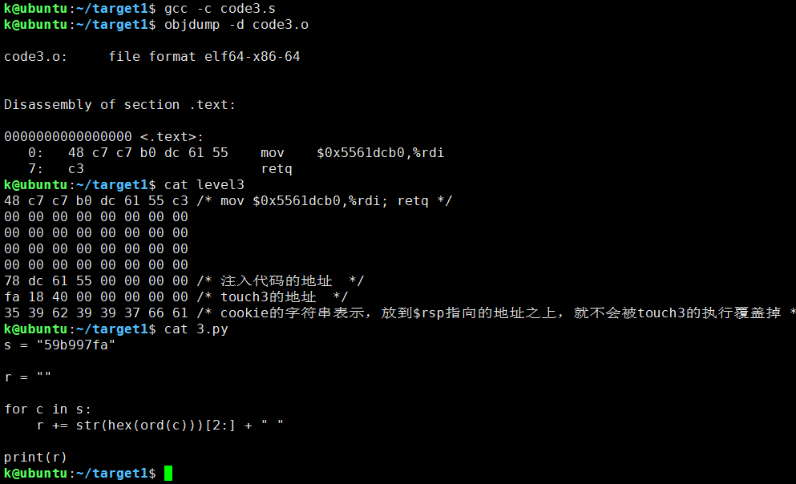
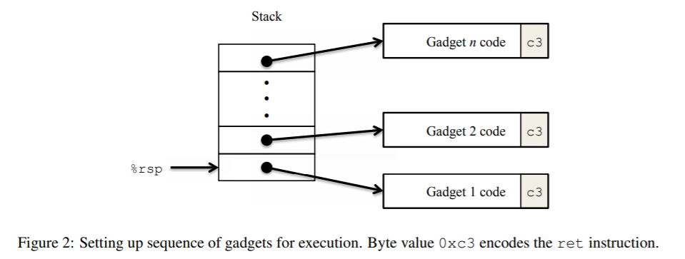
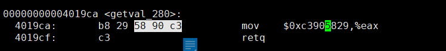
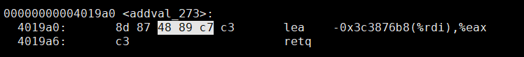
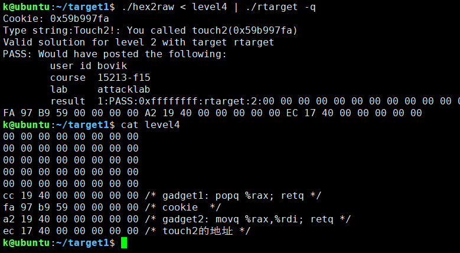
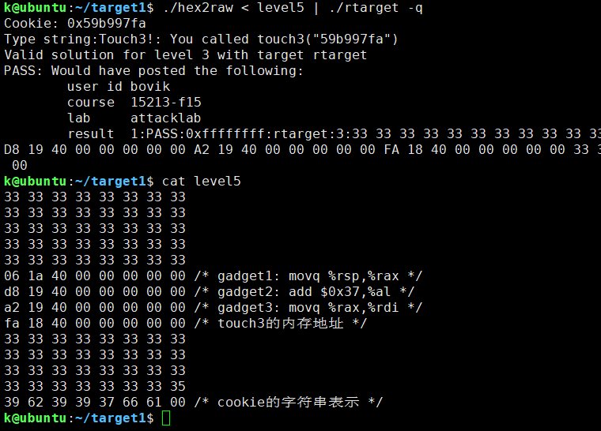

1. 关于hex2raw的使用，详细可看附录A。

   

   ## Part I: Code Injection Attacks

2. Level 1，利用缓冲区溢出修改返回地址，将执行流重定向到函数touch1。

   ```c
   void test()
   {
   	int val;
   	val = getbuf();
   	printf("No exploit. Getbuf returned 0x%x\n", val);
   }
   
   void touch1()
   {
   	vlevel = 1; /* Part of validation protocol */
   	printf("Touch1!: You called touch1()\n");
   	validate(1);
   	exit(0);
   }
   ```

   函数getbuf的代码：

   

   也就是要填充0x28个字节的数据外加8字节的touch1的地址。通过`print touch1`可知道touch1的地址。

   

3. Level 2类似Level 1，但需要注入一些代码。

   ```c
   void touch2(unsigned val)
   {
   	vlevel = 2; /* Part of validation protocol */
   	if (val == cookie) {
   		printf("Touch2!: You called touch2(0x%.8x)\n", val);
   		validate(2);
   	} else {
   		printf("Misfire: You called touch2(0x%.8x)\n", val);
   		fail(2);
   	}
   	exit(0);
   }
   ```

   > Your task is to get CTARGET to execute the code for touch2 rather than returning to test. In this case, however, you must make it appear to touch2 as if you have passed your cookie as its argument.
   >
   > SomeAdvice: 
   >
   > 1. Youwillwanttopositionabyterepresentationoftheaddressofyourinjectedcodeinsuchawaythat ret instruction at the end of the code for getbuf will transfer control to it.
   >
   > 2. Recall that the first argument to a function is passed in register %rdi.
   >
   > 3. Your injected code should set the register to your cookie, and then use a ret instruction to transfer control to the first instruction in touch2.
   >
   > 4. Do not attempt to use jmp or call instructions in your exploit code. The encodings of destination addresses for these instructions are difficult to formulate. Use ret instructions for all transfers of control, even when you are not returning from a call. 
   >
   > 5. See the discussion in Appendix B on how to use tools to generate the byte-level representations of instruction sequences.

   在test函数中使用`print /x cookie`打印该变量的值。进入getbuf函数，`print $rsp`打印栈帧的具体位置，以便确定我们注入的代码的内存地址。用`print touch2`打印函数touch2的地址。

   

   注意写汇编代码时，常熟前面要加上$号，否则汇编出来的机器码不对。还有执行retq执行时，CPU会将$rsp指向的地址处的8字节地址值放入$rip中，然后`$rsp-=8`。如果对内存的内容没有把握的话，可以`./hex2row < level2 > x`，`r -q < x`，下断点，`x/100x $rsp`，`print /x $rsp`，`print /x $rip`等检查相关内容。

4. Level 3类似Level 2，但传递一个字符串作为参数。

   ```c
   /* Compare string to hex represention of unsigned value */
   int hexmatch(unsigned val, char *sval)
   {
   	char cbuf[110];
   	/* Make position of check string unpredictable */
   	char *s = cbuf + random() % 100;
   	sprintf(s, "%.8x", val);
   	return strncmp(sval, s, 9) == 0;
   }
   
   void touch3(char *sval)
   {
   	vlevel = 3; /* Part of validation protocol */
   	if (hexmatch(cookie, sval)) {
   		printf("Touch3!: You called touch3(\"%s\")\n", sval);
   		validate(3);
   	} else {
   		printf("Misfire: You called touch3(\"%s\")\n", sval);
   		fail(3);
   	}
   	exit(0);
   }
   ```

   > Your task is to get CTARGET to execute the code for touch3 rather than returning to test. You must
   > make it appear to touch3 as if you have passed a string representation of your cookie as its argument.
   >
   > Some Advice:
   >
   > 1. You will need to include a string representation of your cookie in your exploit string. The string should consist of the eight hexadecimal digits (ordered from most to least significant) without a leading “0x.”
   > 2. Recall that a string is represented in C as a sequence of bytes followed by a byte with value 0. Type “man ascii” on any Linux machine to see the byte representations of the characters you need.
   > 3. Your injected code should set register %rdi to the address of this string.
   > 4. **When functions hexmatch and strncmp are called, they push data onto the stack, overwriting portions of memory that held the buffer used by getbuf. As a result, you will need to be careful where you place the string representation of your cookie**.

   

   ## Part II: Return-Oriented Programming

5. >  Performing code-injection attacks on program RTARGET is much more difficult than it is for CTARGET, because it uses two techniques to thwart such attacks:
   >
   > 1. **It uses randomization so that the stack positions differ from one run to another. This makes it impossible to determine where your injected code will be located**.
   > 2. **It marks the section of memory holding the stack as nonexecutable, so even if you could set the program counter to the start of your injected code, the program would fail with a segmentation fault**.
   >
   > Fortunately, **clever people have devised strategies for getting useful things done in a program by executing existing code, rather than injecting new code**. The most general form of this is referred to as return-oriented programming (ROP) [1, 2]. **The strategy with ROP is to identify byte sequences within an existing program that consist of one or more instructions followed by the instruction ret. Such a segment is referred to as a gadget.** Figure 2 illustrates how the stack can be set up to execute a sequence of n gadgets. In this figure, **the stack contains a sequence of gadget addresses**. Each gadget consists of a series of instruction bytes, with the final one being 0xc3, encoding the ret instruction. When the program executes a ret instruction starting with this configuration, it will initiate a chain of gadget executions, with the ret instruction at the end of each gadget causing the program to jump to the beginning of the next.
   >
   > 
   >
   > A gadget can make use of code corresponding to assembly-language statements generated by the compiler, especially ones at the ends of functions. In practice, there may be some useful gadgets of this form, but not enough to implement many important operations. For example, it is highly unlikely that a compiled function would have popq %rdi as its last instruction before ret. Fortunately, **with a byte-oriented instruction set, such as x86-64, a gadget can often be found by extracting patterns from other parts of the instruction byte sequence**.
   >
   > Your code for RTARGET contains a number of functions similar to the setval_210 function shown above in a region we refer to as the gadget farm. Your job will be to identify useful gadgets in the gadget farm and use these to perform attacks similar to those you did in Phases 2 and 3.

6. Level 4要求重复Level 2的攻击，但使用ROP。思路是明显的，也就是把cookie值放在栈帧，然后用pop指令直接或间接地把cookie值放入%rdi中。用`objdump -d rtarget > rt`，`sed -n '915,1097p rt > x'`，从x中找了以下两个gadget：

   

   

   

7. Level 5要求用ROP实现Level 3的攻击，这里一个主要的工作就是设置参数，也就是将cookie的字符串表示的内存地址放入%rdi，也就是要计算内存地址。注意，**由于栈的位置是随机的**，也就是不能结合Level 4和Level 3将cookie的字符串表示的地址写入栈中再pop到%rdi中，只能利用%rsp的值，加上偏移量得到字符串的地址，在写入%rdi中。这里直接看了https://zhuanlan.zhihu.com/p/28476993的payload：

   
   
   如果找不到gadget2这样的，也可以在栈中设置某个常数/偏移量，将其pop到某个寄存器中，然后加到%rdi上去。
   
   在上面的payload中，执行gadget1时，%rsp正指向0x4019d8，所以加上0x37（第1位的权是16，16字节也就是payload视图中的两行）后，正好是cookie字符串表示的地址。

