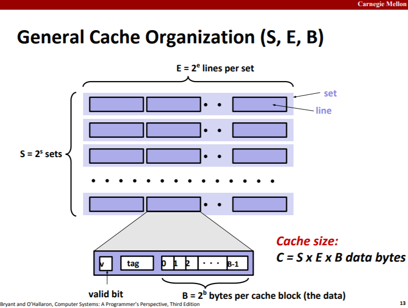
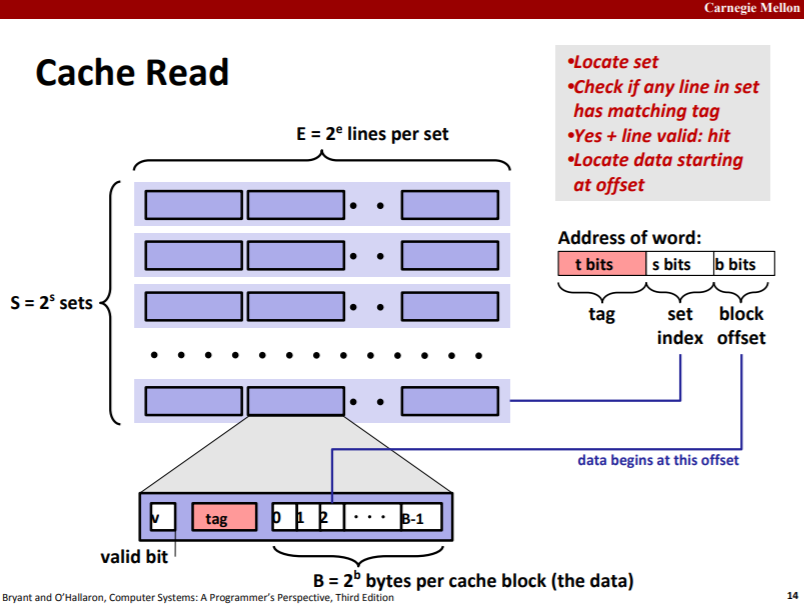
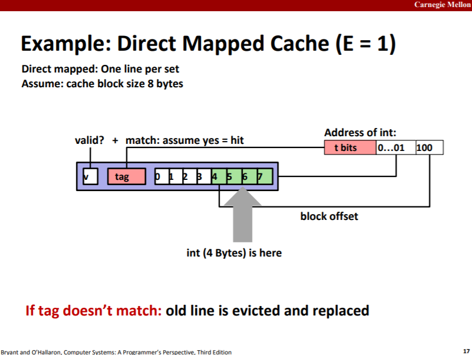
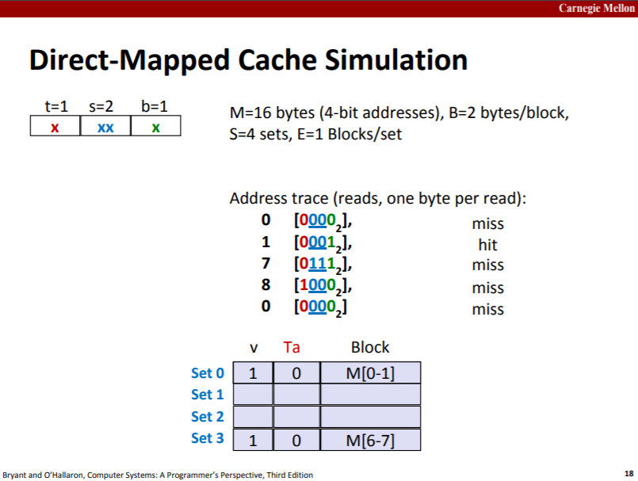
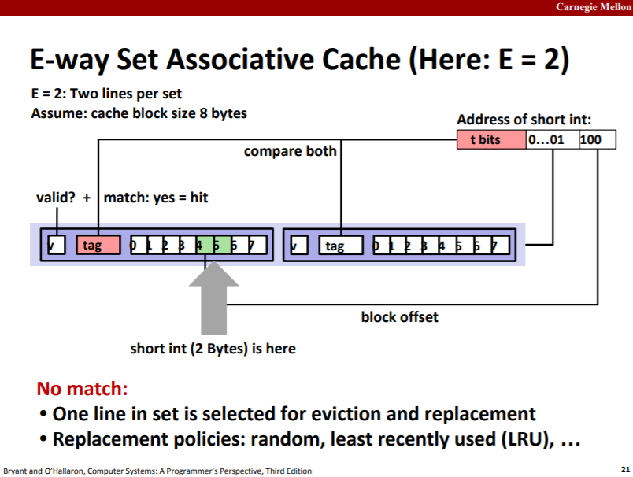
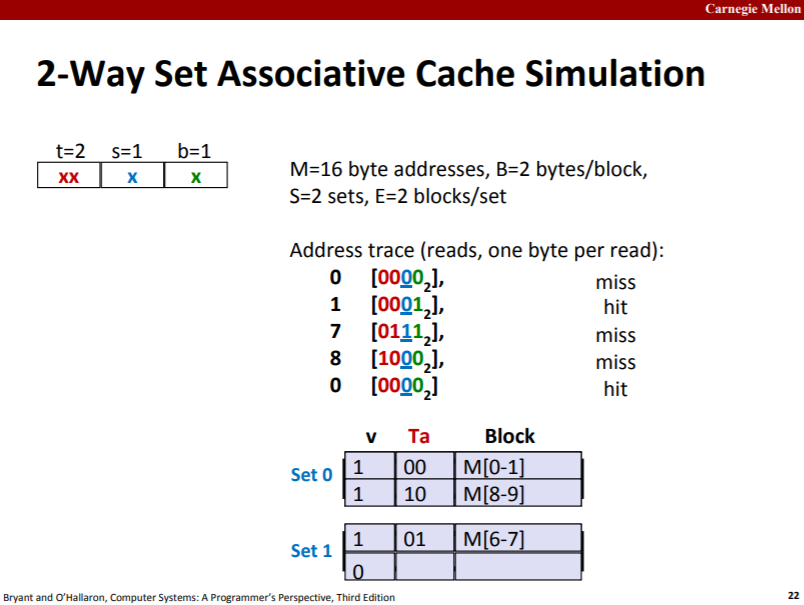
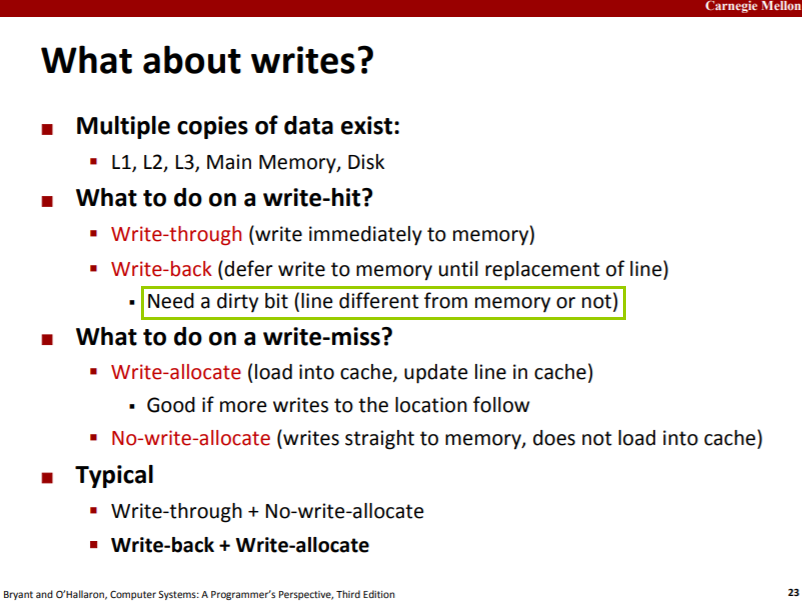
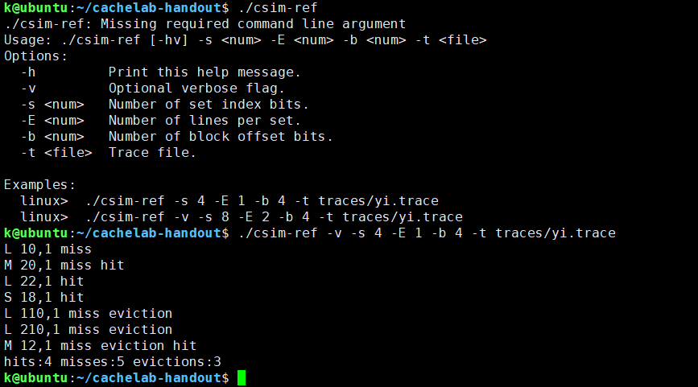

1. 

   

   从cache的视角看，把内存分割为了最小单元为B字节的块而不是字节。cache的每一行中的数据部分可存放来自内存的一个B字节块。

   

   C=S\*E\*B，所以在直接映射中，内存每S个B字节块称为一个块群，块群大小与cache大小相等。直接映射中，内存地址的set index字段也就是块群号。如果块群号大于2^s，内存地址的tag字段就会自增1，所以还需要cache行中还需要tag字段进一步唯一标识一个B字节块。

   

   对于一个B字节块，要将其放到哪一个set/行中呢？看内存地址的set index字段（组索引），因此set index字段的位数s满足`2^s=S`，block offset字段的位数b满足`2^b=B`，tag字段的位数则为`t=m-s-b`。

   

   E路组相联，对一个B字节块，还是先用内存地址的set index字段作为set号选中一个set，然后将该B字节块放入该set中空置的行中，并设置tag为内存地址的tag字段的值。当CPU/MMU检查cache中是否有某个B字节块时，同样用该字节块的内存地址选中set，然后遍历set中的行，比较tag。如果miss了，就访问内存，并放一个副本到cache中，若没有空置行，则要evict一个行，至于哪一行，取决于替换策略，如随机、LRU等。

   

   

   两种搭配，前者以内存为主，后者以cache为主。

2. cache lab的part A要求我们写一个C程序实现读入valgrind生成的内存访问日志文件并模拟统计缓存命中情况。

   

   注意，地址虽然没有0x前缀，但确实是16进制。

   L操作载入一个B字节块，若miss，则要从内存中获取，并留一个副本在cache中，若选中的set没有空行，则要evict，使用LRU策略（Least Recently Used，最少最近使用）。当然，如果E=1的话，就不需要LRU，直接覆盖即可（这个程序只是模拟统计，实际还需要判断被evict的B字节块有没有被修改，若有则还需要写回内存）。对于LRU算法，比较好的实现是[lru-cache](https://leetcode-cn.com/problems/lru-cache/solution/lru-huan-cun-ji-zhi-by-leetcode/)，这里由于使用C语言，就只是简单实现一下，即在每个行中设置一个lru计数器，当一个行被载入B字节块时，初始化为该set中最大的计数器值+1。当这个行被访问（读/写）时，增加计数器，错误，应该设置为该set中最大的计数器值+1。evict时则逐出set中计数器最小的行。

   S操作会先尝试写入cache，不成功则write-allocate。

   M操作=L操作+S操作。由于先执行了L操作，紧接着又执行S操作，所以该S操作必定hit。

3. part B优化矩阵转置可参考：[CS:APP配套实验4：Cache Lab笔记](https://zhuanlan.zhihu.com/p/28585726)，[【读厚 CSAPP】IV Cache Lab](https://wdxtub.com/csapp/thick-csapp-lab-4/2016/04/16/)。

4. **缓存的特性，内存访问读取的一个块，而不是单单几个字节，若多个数据在同一个块中，那么这些数据会一起读入cache中，后续对这些数据的访问就会hit**。

