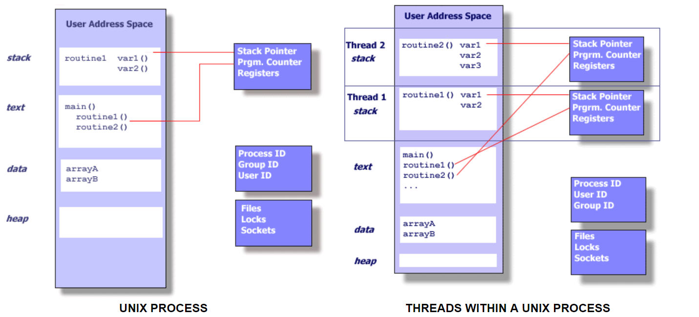
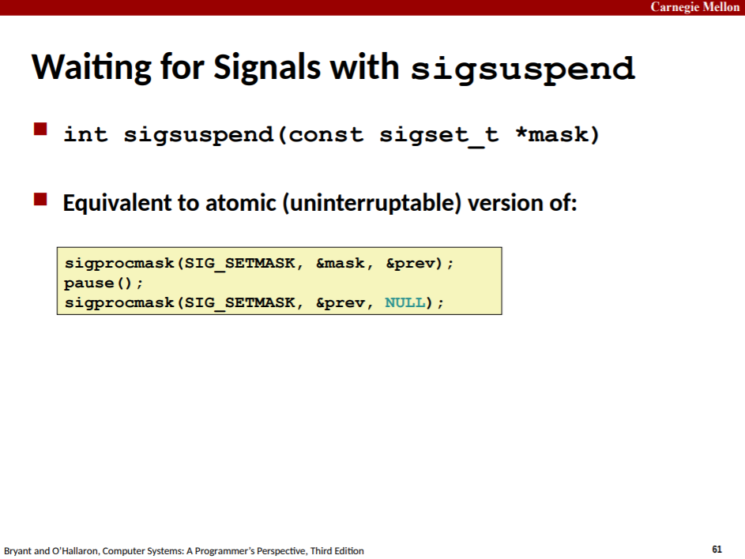

1. 程序与进程：

   程序是一堆代码和数据。程序可以作为目标文件存在于磁盘上，也可以作为段存在于地址空间中。进程包含程序，还包括程序运行所需要的外部资源，如栈内存、堆内存、打开的文件、socket等，也包括程序运行的状态，如SP、PC、寄存器组等，还包括进程本身的一些元数据，如PID、GID、UID、工作目录等。程序总是运行在某个进程的context中。

   

   

2. 为什么进程要reap子进程：

   

   也就是说，一个进程终止/terminate了，表达的是进程运行的程序执行完了。但即使僵尸进程没有运行，进程的元数据、打开的资源还占用着内存。OS当然不会贸然将僵尸进程马上回收，因为这些僵尸进程可能有重要的信息（如自己是如何终止的，还是只是收到SIGSTOP暂停了而已）要在父进程回收时传递给父进程。所以只要父进程还在，OS就不会去回收其子进程。如果父进程没有回收僵尸子进程的话，一些内存资源就会一直被占用着。

3. SIGCHLD handler：

   

   由此，每种信号到达一个进程时，最多只能pending一个。

   所以当回收(reap)子进程时，如果子进程多余两个，且在很短时间内同时退出，即第一个SIGCHLD received，
   信号处理函数正在执行时，第二个SIGCHLD pending，而随后的SIGCHLD信号都会被丢弃。

   因此如果SIGCHLD handler用`if (wait(&status)>0)`，则最多reap两个子进程。所以用while尽可能多地reap僵尸子进程。

   但又不能用wait，因为它会挂起调用进程直到调用进程的子进程有一个终止。所以要用waitpid，且结合一些选项。

   

4. 在这个lab中，foreground job也就是shell**异步阻塞“调用”**一个job，而background job就是shell**异步非阻塞“调用”**一个job，两者都通过OS发给shell的SIGCHLD信号让shell知道job执行完。所以运行一个foreground job意味着阻塞shell，运行一个backgrond job就不需要阻塞shell。

5. 注意在signal handler中使用如printf之类的标准I/O函数是不安全的，应该使用系统调用write来输出。可以使用csapp.c中包装的sio系列函数。

6. 

   

   

   

   

   

7. 

   

   

8. 

   

   

9. 

   

   

   前者，如果在判断后，pause调用前，收到SIGCHLD，那么就会一直挂起，不会返回。

   

   

10. 

11. **fork的子进程也继承了父进程设置的信号处理函数，而execve执行另一个程序后，就不再继承父进程设置的信号处理函数了**。

   ```c
#include <sys/types.h>
#include <unistd.h>
#include <stdlib.h>
#include <signal.h>
#include <stdio.h>
#include <errno.h>

extern char **environ;

void sigint_handler(int sig) {
    // printf("SIGINT\n"); // unsafe
	sio_puts("SIGINT\n");
    exit(EXIT_SUCCESS);
}

ssize_t sio_puts(char *s) {
	return write(STDOUT_FILENO, s, sio_strlen(s));
}

static size_t sio_strlen(char *s) {
	int i = 0;
	while (s[i]!='\0')
		++i;
	return i;
}

int main(int argc, char **argv) {
    pid_t pid;

    signal(SIGINT, sigint_handler);

    if ((pid = fork()) == 0) {
		pause();
    }
    sleep(2);
    kill(pid, SIGINT);
    // 输出SIGINT

    if ((pid = fork()) == 0) {
		argv[0] = "./myspin";
		if (execve(argv[0], argv, environ) < 0)
			printf("%d", errno);
    }
    sleep(2);
    kill(pid, SIGINT);
    // 没有输出SIGINT
    sleep(10);
}
   ```

   

