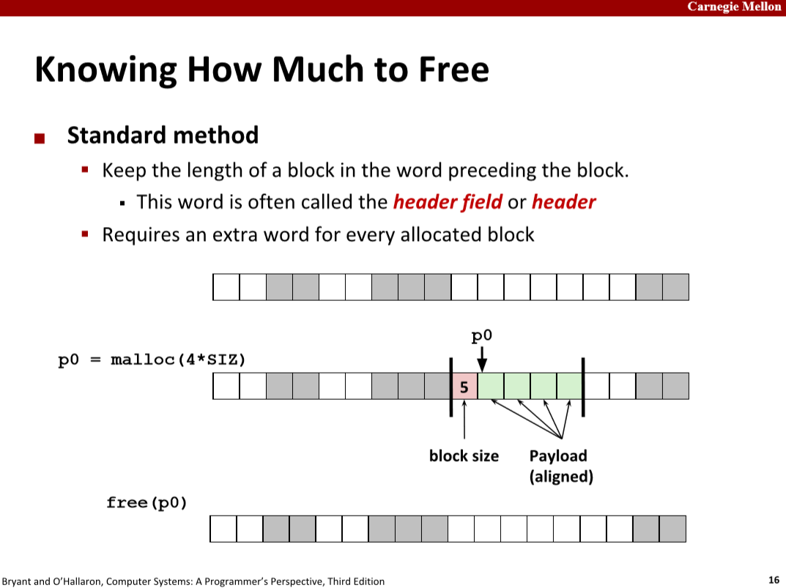
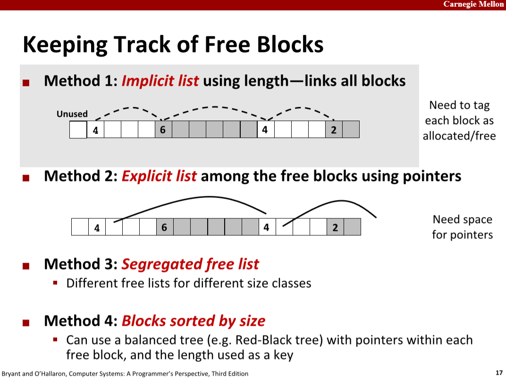
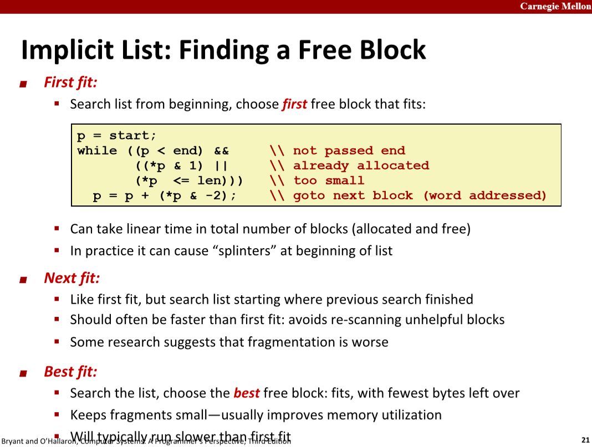
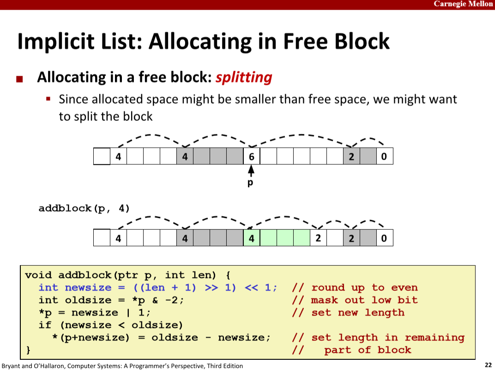
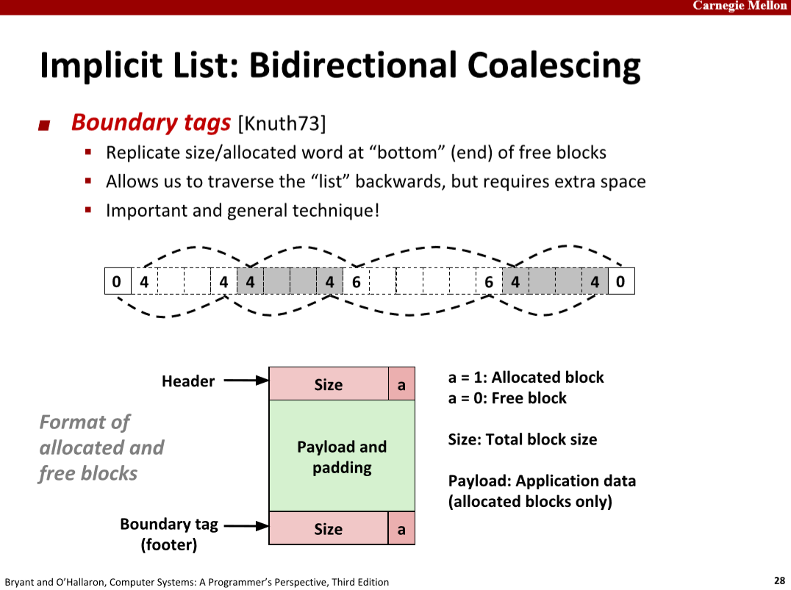
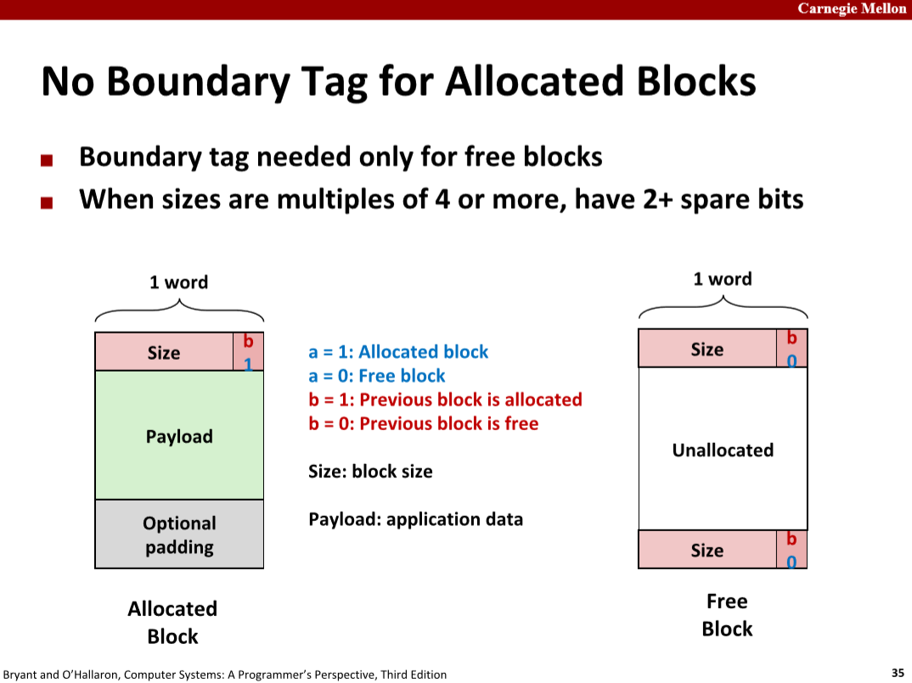
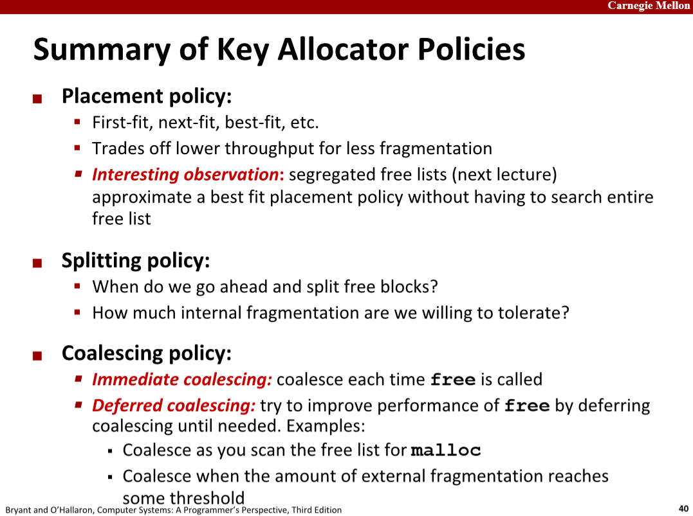
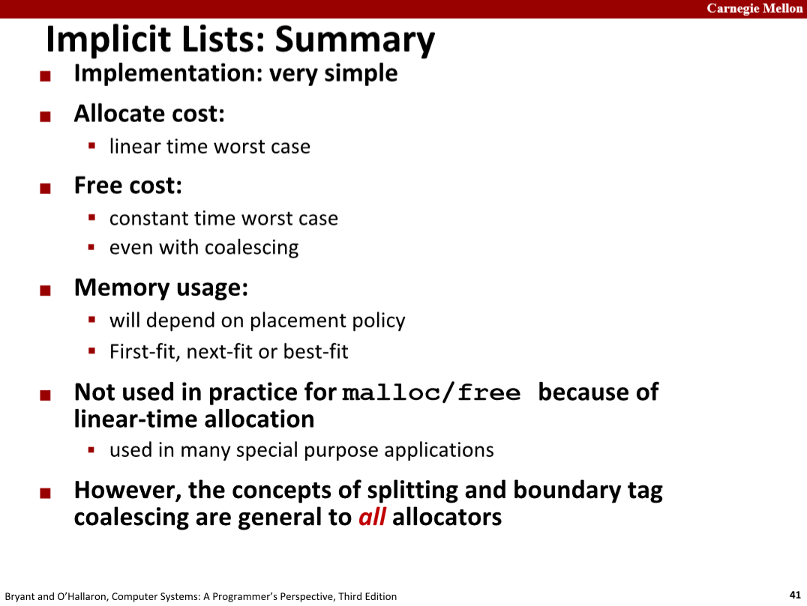
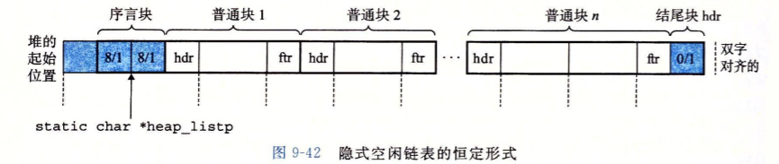

1. Implementation Issues:

   - How do we know **how much memory to free given just a pointer**?
   
     
   
   - How do we **keep track of the free blocks**?
   
     
   
   - How do we **pick a block to use for allocation** -- many might fit?
   
     
   
   - What do we do with the extra space when allocating a structure that is **smaller than the free block it is placed in**?
   
     
   
   - How do we **reinsert freed block**?
   
     
   
     
   
   
   
   
   
2. > For consistency with the libc malloc package, which returns blocks aligned on 8-byte boundaries,
   > **your allocator must always return pointers that are aligned to 8-byte boundaries**.

   数据对齐存放的解释：

   > 作者：赵劼
   >
   > Many computer systems place restrictions on the allowable addresses for the primitive data types, requiring that the address for some type of object must be a multiple of some value K (typically 2, 4, or 8). **Such alignment restrictions simplify the design of the hardware forming the interface between the processor and the memory system.** For example, **suppose a processor always fetches 8 bytes from memory with an address that must be a multiple of 8**. If we can guarantee that any double will be aligned to have its address be a multiple of 8, then the value can be read or written with a single memory operation. Otherwise, we may need to perform two memory accesses, since the object might be split across two 8-byte memory blocks.
   
   也就是，在程序员看来，内存是一个最小单元为字节的数组，而在CPU看来，则是一个最小单元可能为8字节块的数组。数据对齐存放有利于提高程序运行效率。
   
   在malloc lab中，我们写的allocator是通过malloc调用获得heap内存，由于**malloc返回的内存就是8字节对齐的**，并且**对于隐式链表的组织方式，头部和尾部会用掉总共一个DWORD**（在这个lab中，一个WORD定义为4字节），若设定块的大小为8字节/DWORD的整数倍，且最小为2*DWORD（只有头尾，payload为0\*DWORD）（即payload大小为DWORD的整数倍，最小为0），那么那么的按照如下组织形式，就**可以保证分配的块的payload是8字节对齐的**。
   
   理论上只需要空出第一个WORD，而这里还放了一个序言块（头部+尾部，没有payload），且在heap内存的末尾放置了一个结尾块的头部，这是**消除合并时边界条件的技巧**，当客户端free内存时，allocator合并空闲块时，不必进行边界检查，**因为边界总有块存在，且一直被标记为已分配**。
   
   
   
3. 将低n位round up，round up后，低n位必为0。

   ```c
   #include <stdio.h>
   
   int roundup(int x, int n) {
       // 本质是低n位只要不全为0就使其进到第n位，再清零。
       int tmp = (1<<n)-1;
       return (x+tmp)&(~tmp);
   }
   
   int main() {
       // 将低1位round up，也就是将一个数向上舍入为偶数，若本来就是偶数（即若本来低1位就是0），则不变。
       int a1 = 9;
       int a2 = 20;
       printf("%d, %d\n", roundup(a1, 1), roundup(a2, 1));
       // 10, 20
   
       // 将低8位round up。
       int a3 = 1024;
       int a4 = 257;
       printf("%d, %d\n", roundup(a3, 8), roundup(a4, 8));
       // 1024, 512
   }
   ```

4. [CS:APP配套实验6：Malloc Lab笔记](https://zhuanlan.zhihu.com/p/28806499#comments)

  