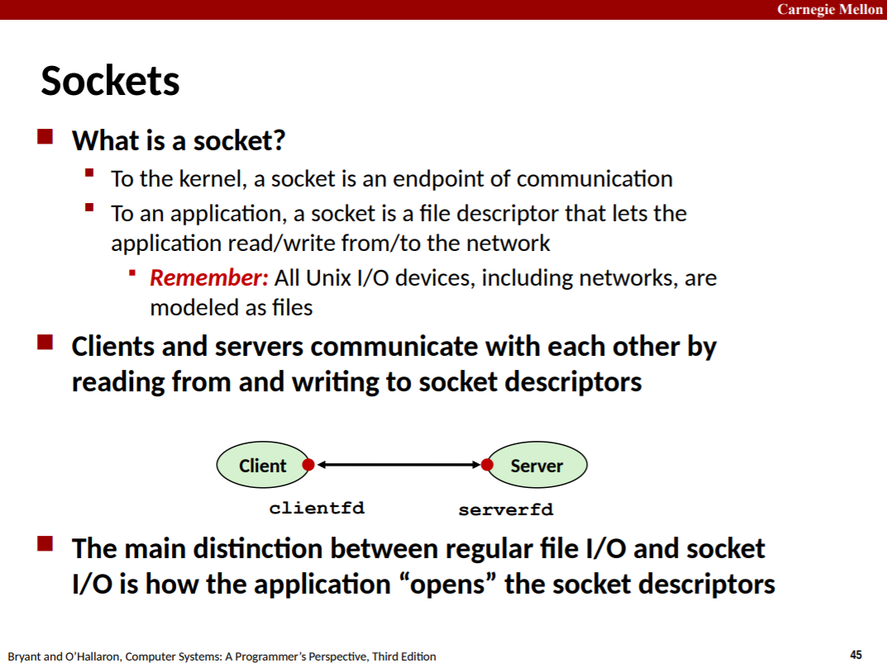

上面这张图很重要。

创建socket fd并不是通过open()，而是socket()。

```c
int socket(int domain, int type, int protocol);
```

注意到，socket fd本身并不携带地址信息，但它会和地址信息相关联，包括本地地址和对端地址。地址信息可能包括地址族(address family)、端口、IP地址等，常见的有`struct sockaddr_in`。

由于socket fd本身不携带地址信息，所以可以看到一些相关的调用不仅要求传入socket fd，还要求传入地址信息。

```c
// 其中addr为对端主机的地址信息，client的本地地址常常由内核选择。
int connect(int sockfd, const struct sockaddr *addr, socklen_t addrlen);
```

```c
// 通过bind()将sockfd与地址信息addr关联/绑定起来。client也可调用，只不过通常由内核选择。
int bind(int sockfd, const struct sockaddr *addr, socklen_t addrlen);

// listen() marks the socket referred to by sockfd as a passive socket, that is, as a socket that will be used to accept incoming connection requests using accept(2).
int listen(int sockfd, int backlog);

// 由于socket fd本身不携带地址信息，所以accept()分两次返回与client通信的socket fd和client的地址信息。
int accept(int sockfd, struct sockaddr *addr, socklen_t *addrlen);
```

