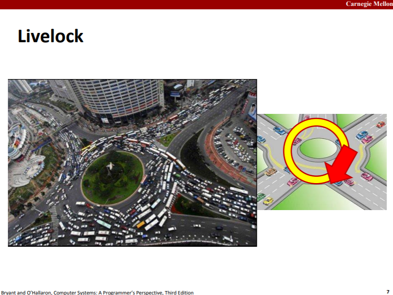

1. 

   

   **之所以不能混用带缓存和不带缓存的读函数，是因为带缓存的读函数会预先从fd中读入一些数据，比如fd指向的文件内容为"1235679"，客户端要求读入"123"，而带缓存而将读入"123567"，此时file offset指向'9'，如果再用不带缓存的函数读，此时客户期望读入"567"，但显然，对于这个fd来说，"567"已经被读出了**。

   

2. 

3. 

   

   

4. 

5. 

   

   

6. 

   

   

   

   

   

   

   

   

   

7. 

   可重入函数，当它们被多个线程调用时，不会引用任何共享数据。

   

   

   这一类函数线程不安全是明显的，因为多个线程同时调用时，没有用互斥措施使得对共享变量的更新是原子的（如加锁使得一条语句的底层执行（有多个步骤）或一个代码块的执行是原子的），那么就会产生race。

   修复方法当然是用互斥措施消除race。

   

   

   这一类不是线程安全是因为如果一个函数依赖上一个调用状态A来产出结果，那么当该函数被多个线程同时调用时，可能这多个调用读到的都是调用状态A，然后产出了同样的结果。正确应该是比如3个调用，第一个调用依赖调用状态A产出状态B，第二个调用看到的是状态B而不是状态A，然后产出状态C，同理，第三个调用依赖状态C产出状态D。

   修复方法只能是重写，使得不让callee自己保存调用状态，而让caller保存调用状态，调用时再作为参数传入。

   上面的修复例子中，每一个线程有自己的next值，这样就不会出现上面的问题。

   

   该类函数线程不安全是因为暴露了内部状态，使得内部状态的修改，外部可见。如果线程A调用itoa(10)得到"10"，在线程A开始处理这个调用结果前，线程B调用itoa(20)得到"20"，那么线程A看到的返回结果就不再是"10"而是"20"了。

   修复方法，要么callee不要暴露内部状态，要求caller传入一个地址，将结果写入该地址处；要么caller不理会/不使用callee暴露出的状态，加锁调用然后自己拷贝一份。

   

   修复的方法是根据该函数调用的线程不安全函数的类型（第一/二/三类），进行相应的修复。

8. A race occurs when correctness of the program depends on one thread reaching point x before another thread reaches point y.

   Def: A process is deadlocked iff it is waiting for a condition that will never be true. 
   
   
   
   

