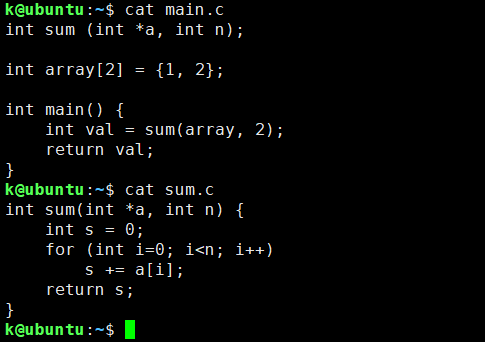

预处理和编译后产生ASCII汇编语言文件，汇编后产生可重定位目标文件。

编译后的汇编文件中没有类型信息，类型信息在CPU算术逻辑运算时给出操作数大小，在内存访问时给出对象大小。编译过程已经根据类型信息产出了适当的算术逻辑运算指令和内存访问指令，之后也就不需要类型信息了。

如结构体对象X，其地址放在%rbx中，有一个int成员a，若int类型占4字节，那么`X.a = 10;`，会被翻译为`movl $10, offset(%rbx)`。可以看到在编译的过程中，就已经利用了类型信息产出了在指定地址处设置/获取了该类型对应大小的内存块的指令，所以编译完后，类型信息也就没有用处了。

.bss节记录未初始化或初始化为0的全局或静态变量，不同于.data节，这些变量在.bss节中并不占实际的磁盘空间，只是一个占位符，只需在程序加载时由loader在内存中分配指定大小的内存块（未初始化的变量只需做到这里），并初始化为0。

符号解析：引用 -> 符号，这是一种多对一关系。

重定位：合并.text和.data节，符号地址更新为运行时地址，在引用该符号的地方（**从.rel.text和.rel.data节的条目中知道都有哪些引用和引用所处的位置**，用`objdump -r .o`可查看重定位条目）根据符号的运行时地址填写相应的值（偏移量或绝对地址）。

**注意符号还包括.text这样的符号，它们的地址在链接前也是0**。

假设算法运行时，ld已经为每个节和每个符号都选择了运行时地址（用ADDR(s)和ADDR(r.symbol)表示）。

算法对相对引用填入指令距离符号的距离，对绝对引用填入符号的运行时地址。

使用静态库的程序，若静态库中添加或修改了某个.o文件，那么一个程序要获得这种更新，必须重新链接。

